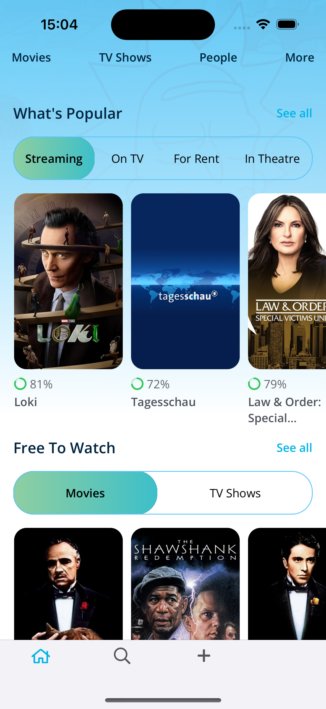
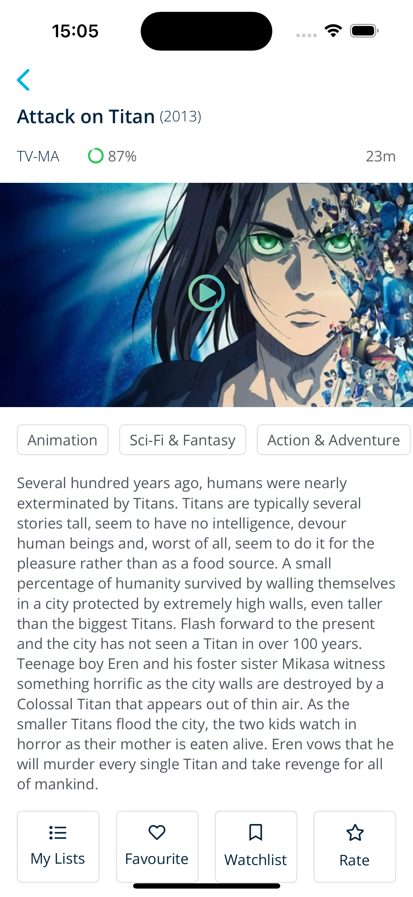

# Movies App

-----------------------------------------------------

 
 
 
 

## Table of Contents
1. [Introduction](#introduction)
2. [Design](#design)
3. [Required Functionality](#required-functionality)
4. [Technology Stack](#technology-stack)
5. [Installation](#installation)
6. [Usage](#usage)
7. [Contributing](#contributing)
8. [License](#license)

## Introduction

The Movies App is a mobile application designed to explore and display information about movies using data from The Movie Database (TMDb) API. This app allows users to discover, search, and view details about movies and is developed with a focus on creating a visually appealing and user-friendly interface.

## Design

The app's design was created using Figma and can be viewed [here](https://www.figma.com/file/CNCmIc70jHYyikvOYL108c/Movies). It emphasizes a modern and intuitive user experience, making it easy for users to explore and interact with movie data.

## Required Functionality

### Key Features
- Create the app's user interface based on the provided design.
- Connect the app to The Movie Database (TMDb) API to fetch movie data.
- Display a list of movies with details like title, poster, and release date.
- Implement a search feature to allow users to search for movies by title.
- Show movie details, including a synopsis, rating, and additional information.
- Ensure compatibility with iOS 13 and later.
- Implement asynchronous image loading for a smooth user experience.
- Prioritize accessibility for all users.

## Technology Stack

The Movies App is built using the following technology stack and third-party libraries:

- Swift
- Texture (AsyncDisplayKit) for high-performance and smooth scrolling user interfaces
- Code-only layout for flexible and efficient UI design
- Integration with The Movie Database (TMDb) API for movie data
- iOS 13 or later to take advantage of the latest iOS features
- Accessibility features to ensure inclusivity

**Third-party Libraries**

- [Alamofire](https://github.com/Alamofire/Alamofire): A Swift-based HTTP networking library for making API requests.
- [TTSegmentedControl](https://github.com/dumitruigor/TTSegmentedControl): A segmented control library for creating segmented views.
- [MBCircularProgressBar](https://github.com/matibot/MBCircularProgressBar): A circular progress bar library for displaying progress indicators.
- [HMSegmentedControl](https://github.com/danmarchuk/HMSegmentedControl): A custom segmented control library (adjusted by myself :-)) for creating segmented views.

## Installation

To install and run the Movies App on your iOS device or simulator (iOS 13 or later), follow these steps:

1. Clone this repository.
2. Open the project in Xcode.
3. Build and run the app on your device or simulator.

## Usage

1. Launch the app.
2. Explore the list of movies with their titles, posters, and release dates.
3. Use the search feature to find specific movies by title.
4. Click on a movie to view its details, including the synopsis, rating, and additional information.
5. Enjoy a smooth and responsive user interface, thanks to the use of Texture (AsyncDisplayKit).
6. Ensure accessibility for all users with inclusive design.

## Contributing

Contributions to this project are welcome. If you would like to contribute, please follow these guidelines:

1. Fork the repository.
2. Create a new branch for your feature or bug fix.
3. Make your changes and test thoroughly.
4. Create a pull request, explaining your changes and providing details on how to test them.

## License

This project is licensed under the [MIT License](LICENSE).

Feel free to reach out to the project maintainers for any questions or feedback. Thank you for using the Movies App!
